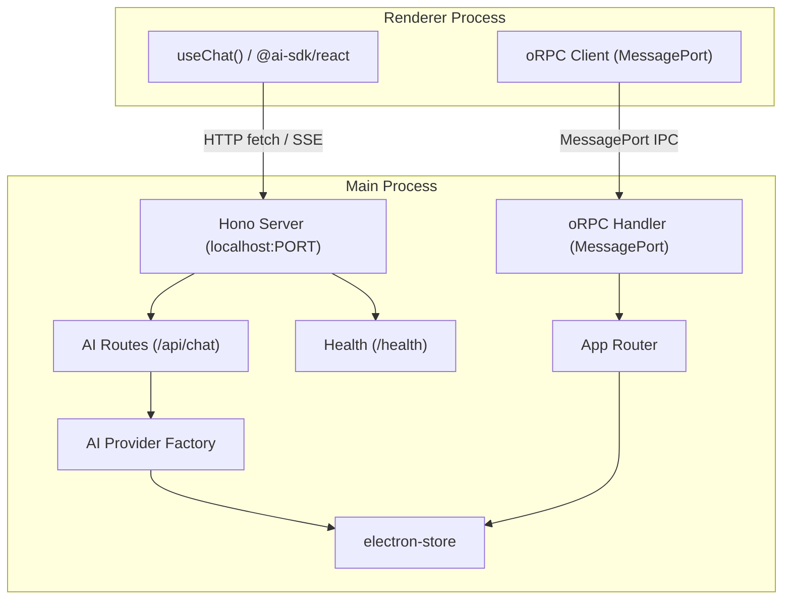

# Hono 本地服务 + Vercel AI SDK 集成

## 架构总览

在 Electron main process 中启动 Hono HTTP 服务（`@hono/node-server`），提供本地 API 端点。现有的 oRPC MessagePort IPC 保持不变（用于 settings、fonts 等），Hono 服务新增 AI 流式对话端点。Renderer 通过 `@ai-sdk/react` 的 `useChat` + `DefaultChatTransport` 连接本地 Hono 服务。



## 依赖安装

在 `apps/desktop/` 目录执行：

```bash
pnpm add hono @hono/node-server @ai-sdk/openai @ai-sdk/anthropic
pnpm add -D @ai-sdk/react
```

- `hono` + `@hono/node-server` — Hono 框架 + Node.js adapter
- `@ai-sdk/openai` — OpenAI provider（直连）
- `@ai-sdk/anthropic` — Anthropic provider（直连）
- `@ai-sdk/react` — 前端 `useChat` hook（devDependency，仅 renderer 使用）
- `ai` — 已存在（`^6.0.134`），内置 `gateway` provider（Vercel AI Gateway）
- **不需要** `@ai-sdk/gateway`，`ai` 包已内置

## 实现步骤

### Step 1: Hono 服务基础设施

新建 `apps/desktop/src/main/server/` 目录：

**[apps/desktop/src/main/server/app.ts](apps/desktop/src/main/server/app.ts)** — Hono 应用实例

```typescript
import { Hono } from 'hono'
import { cors } from 'hono/cors'
import { logger } from 'hono/logger'
import { chatRoute } from './routes/chat'

const app = new Hono()

app.use(cors({ origin: '*' }))
app.use(logger())

app.get('/health', (c) => c.json({ ok: true }))
app.route('/api', chatRoute)

export { app }
```

**[apps/desktop/src/main/server/index.ts](apps/desktop/src/main/server/index.ts)** — 服务生命周期管理

- 使用 `@hono/node-server` 的 `serve()` 启动服务
- 端口策略：`port: 0`（OS 自动分配空闲端口），避免端口冲突
- 导出 `startServer()` / `stopServer()` / `getServerUrl()`
- 在 `app.on("ready")` 中调用 `startServer()`，在 `app.on("before-quit")` 中调用 `stopServer()`

### Step 2: AI Provider 工厂

**[apps/desktop/src/main/server/lib/providers.ts](apps/desktop/src/main/server/lib/providers.ts)** — Provider 配置

- 根据 settings 中的 provider 配置，动态创建 AI provider 实例
- 支持 3 种 provider：
  - `openai` — `createOpenAI({ apiKey })` from `@ai-sdk/openai`
  - `anthropic` — `createAnthropic({ apiKey })` from `@ai-sdk/anthropic`
  - `gateway` — `gateway('provider/model')` from `ai`（内置，需 `AI_GATEWAY_API_KEY`）
- 从 `electron-store` 读取 API key，不硬编码

### Step 3: 流式对话路由

**[apps/desktop/src/main/server/routes/chat.ts](apps/desktop/src/main/server/routes/chat.ts)** — Chat 端点

```typescript
import { Hono } from 'hono'
import { streamText } from 'ai'
import { resolveModel } from '../lib/providers'

const chatRoute = new Hono()

chatRoute.post('/chat', async (c) => {
  const { messages, model: modelId } = await c.req.json()
  const model = resolveModel(modelId)
  const result = streamText({ model, messages })
  return result.toUIMessageStreamResponse()
})

export { chatRoute }
```

关键点：
- 使用 `streamText` 而非 `generateText`，支持流式输出
- 返回 `toUIMessageStreamResponse()`（AI SDK v6 的正确 API，不是 `toDataStreamResponse`）
- `resolveModel()` 根据 modelId 字符串（如 `"openai/gpt-4o"`）解析出对应的 provider + model

### Step 4: Settings Schema 扩展

**[packages/rpc/src/schemas/settings.ts](packages/rpc/src/schemas/settings.ts)** — 新增 AI 配置字段

在 `AppSettingsSchema` 中新增 `ai` 字段：

```typescript
const AiProviderConfigSchema = z.object({
  apiKey: z.string().default('')
})

const AiSettingsSchema = z.object({
  defaultProvider: z.enum(['openai', 'anthropic', 'gateway']).default('openai'),
  defaultModel: z.string().default(''),
  providers: z.object({
    anthropic: AiProviderConfigSchema.default({}),
    gateway: AiProviderConfigSchema.default({}),
    openai: AiProviderConfigSchema.default({})
  }).default({})
}).default({})
```

- 所有字段都有 `.default()`，保证旧设置文件自动补全
- API Key 通过 settings 管理，后续可考虑 `safeStorage` 加密

### Step 5: 暴露服务 URL 给 Renderer

在现有 oRPC router（[apps/desktop/src/main/rpc/router.ts](apps/desktop/src/main/rpc/router.ts)）中新增 procedure：

```typescript
const serverGetUrl = os
  .output(z.object({ url: z.string() }))
  .handler(() => ({ url: getServerUrl() }))

export const router = {
  // ...existing procedures
  server: {
    getUrl: serverGetUrl
  }
}
```

在 `@etyon/rpc` 中新增对应的 schema：`ServerUrlOutputSchema`

### Step 6: Renderer 端 AI 集成

**[apps/desktop/src/renderer/lib/ai/transport.ts](apps/desktop/src/renderer/lib/ai/transport.ts)** — Chat Transport

```typescript
import { DefaultChatTransport } from 'ai'
import { rpcClient } from '../rpc'

let transport: DefaultChatTransport | undefined

export const getChatTransport = async () => {
  if (!transport) {
    const { url } = await rpcClient.server.getUrl()
    transport = new DefaultChatTransport({ api: `${url}/api/chat` })
  }
  return transport
}
```

**Renderer 使用** — 在组件中通过 `useChat` 消费：

```tsx
import { useChat } from '@ai-sdk/react'
import { useState } from 'react'

const { messages, sendMessage } = useChat({ transport })
const [input, setInput] = useState('')
```

注意 AI SDK v6 变更：
- `useChat` 不再内置 input state，需手动管理
- 使用 `sendMessage()` 替代 `handleSubmit`
- 使用 `DefaultChatTransport` 替代 `api` 选项

### Step 7: Vite 配置调整

**[apps/desktop/vite.main.config.ts](apps/desktop/vite.main.config.ts)** — 可能需要调整：

- 确认 `hono` 和 `@hono/node-server` 不在 `external` 中（应被打包）
- 如果遇到 ESM/CJS 兼容问题，可能需要添加到 `optimizeDeps` 或调整 `external`

### Step 8: 文档

新增两篇文档：

- `doc/server.md` — Hono 本地服务架构、端口策略、路由注册、扩展指南
- `doc/ai.md` — AI SDK 集成说明、Provider 配置、API Key 管理、useChat 用法

## 文件变更清单

| 文件 | 操作 | 说明 |
|------|------|------|
| `apps/desktop/package.json` | 修改 | 添加 hono / provider / react 依赖 |
| `apps/desktop/src/main/server/app.ts` | 新建 | Hono 应用实例 + 中间件 |
| `apps/desktop/src/main/server/index.ts` | 新建 | 服务生命周期 |
| `apps/desktop/src/main/server/routes/chat.ts` | 新建 | AI 流式对话路由 |
| `apps/desktop/src/main/server/lib/providers.ts` | 新建 | AI Provider 工厂 |
| `apps/desktop/src/main/index.ts` | 修改 | 在 ready 中启动 Hono，quit 时关闭 |
| `apps/desktop/src/main/rpc/router.ts` | 修改 | 新增 `server.getUrl` procedure |
| `packages/rpc/src/schemas/settings.ts` | 修改 | 新增 AI 配置 schema |
| `packages/rpc/src/schemas/server.ts` | 新建 | Server URL output schema |
| `packages/rpc/src/index.ts` | 修改 | 导出 server schema |
| `apps/desktop/src/renderer/lib/ai/transport.ts` | 新建 | Chat transport 配置 |
| `apps/desktop/vite.main.config.ts` | 可能修改 | ESM 兼容性调整 |
| `doc/server.md` | 新建 | Hono 服务文档 |
| `doc/ai.md` | 新建 | AI SDK 集成文档 |

## 安全考量

- Hono 服务仅绑定 `127.0.0.1`（localhost），不对外暴露
- CORS 限制为本地源
- API Key 存储在 `electron-store`（`~/.config/etyon/settings.json`），后续可引入 `safeStorage` 加密
- 不在日志中记录 API Key
